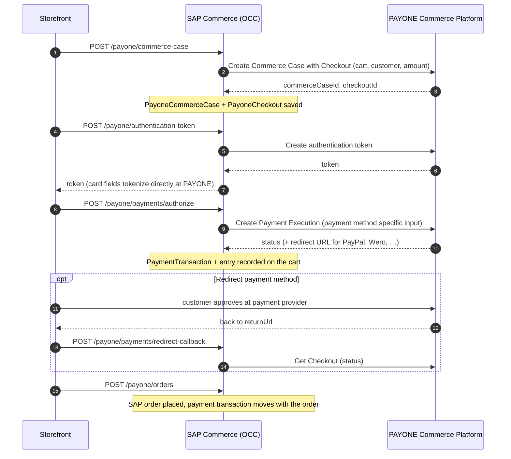
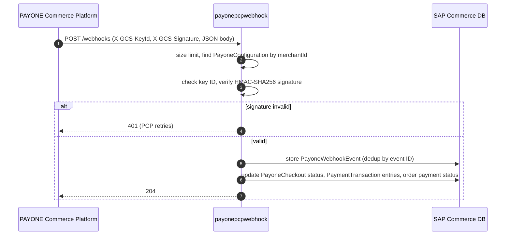

# PAYONE Commerce Platform Plugin for SAP Commerce Cloud

Connects SAP Commerce Cloud 2211 to the **PAYONE Commerce Platform (PCP)**: checkout and
payment through OCC for a Composable Storefront (Spartacus), inbound PCP webhooks, and
Backoffice tooling for configuration, monitoring and post-order payment operations.

- PCP documentation: <https://docs.commerce.payone.com>
- PCP API reference: <https://docs.commerce.payone.com/api-reference>

> **About this plugin**
>
> This plugin is a tested, production-grade foundation for integrating the PAYONE Commerce
> Platform into SAP Commerce Cloud. It covers the core checkout, webhook and payment
> operation flows end to end and follows SAP clean-core principles, so it installs without
> changes to the platform.
>
> Every SAP Commerce project has its own order process, storefront, roles and operating
> model. The plugin is therefore designed as a base to build on: extend it to your
> processes, add the payment methods and features your business needs (see
> [section 10](#10-not-yet-available-in-this-version)), and run your own acceptance tests
> against your PAYONE merchant setup before going live. The plugin is provided as is,
> without warranty; responsibility for configuration, extension and operation in your
> environment lies with the implementing project.

---

## Contents

1. [Prerequisites](#1-prerequisites)
2. [Extension structure](#2-extension-structure)
3. [Installation](#3-installation)
4. [Configuration](#4-configuration)
5. [Checkout flow](#5-checkout-flow)
6. [Webhook flow](#6-webhook-flow)
7. [Post-order payment operations](#7-post-order-payment-operations)
8. [Backoffice](#8-backoffice)
9. [Supported payment methods](#9-supported-payment-methods)
10. [Not yet available in this version](#10-not-yet-available-in-this-version)
11. [Building and testing](#11-building-and-testing)

---

## 1. Prerequisites

| Requirement | Version / detail |
|---|---|
| SAP Commerce Cloud | **2211**, JDK 21 build |
| Java | **21** (SAP Machine 21) |
| OOTB extensions | `commerceservices`, `payment`, `commercefacades`, `commercewebservices`, `webservicescommons`, `backoffice` |
| PCP server SDK | `io.github.payone-gmbh:pcp-serversdk-java` **1.13.0**, shipped in `payonepcpcore/lib` together with its runtime dependencies (Jackson 2.17.2, OkHttp 4.12.0, Okio 3.6.0, Kotlin stdlib 1.9.10) |
| PAYONE merchant account | PCP merchant ID, API key ID and API secret for each merchant (pre-production and production) |
| Storefront | Composable Storefront (Spartacus) that calls the OCC endpoints below. The storefront library itself is **not** part of this repository. |
| Database | Any SAP Commerce production database. HSQLDB works for most features, but see [section 7](#7-post-order-payment-operations). |

**Typecodes.** The plugin reserves typecode range **15110–15139**. Check that no other
extension in your system uses this range before installing.

---

## 2. Extension structure

All extensions live under `core-customize/hybris/bin/custom/`.

```
payonepcpcore          domain model, PCP SDK integration, payment strategies, configuration
  ▲
  ├── payonepcpfacades   checkout orchestration and payment-operation facades
  │     ▲
  │     └── payonepcpocc   OCC REST endpoints for the storefront (mounted under /occ/v2)
  │
  ├── payonepcpwebhook   inbound PCP webhooks (own web module: /payonepcpwebhook)
  │
  └── payonepcpbackoffice  Backoffice editors, dashboard widget, Capture/Refund actions
                           (also depends on payonepcpfacades and payonepcpwebhook)
```

| Extension | Purpose | CCv2 aspect |
|---|---|---|
| `payonepcpcore` | Item types (`PayoneConfiguration`, `PayoneCommerceCase`, `PayoneCheckout`, `PayonePaymentInfo`, …), per-store configuration and secret resolution, PCP SDK clients, one payment strategy per payment method | all |
| `payonepcpfacades` | `PayoneCheckoutFacade` (checkout), `PayonePaymentOperationsFacade` (capture/refund/cancel/…), `PayoneCheckoutOperationsFacade` (guarded Backoffice operations) | all |
| `payonepcpocc` | `PayoneCheckoutController`, the OCC surface consumed by the storefront | `api` |
| `payonepcpwebhook` | Webhook receiver: signature check, storage, deduplication, event processing | storefront / accstorefront (the aspect that serves `/payonepcpwebhook`) |
| `payonepcpbackoffice` | Backoffice configuration editors, read-only views, dashboard tile, Capture/Refund actions | `backoffice` |

Every extension has its own `README.md` with details. The Backoffice payment actions also
have an operating guide:
[`payonepcpbackoffice/RUNBOOK-payment-actions.md`](core-customize/hybris/bin/custom/payonepcpbackoffice/RUNBOOK-payment-actions.md).

---

## 3. Installation

1. **Copy the extensions** from `core-customize/hybris/bin/custom/` into your project's
   `core-customize/hybris/bin/custom/`.

2. **Register them** in `localextensions.xml` (locally) and in the `extensions` list of your
   CCv2 `manifest.json`:

   ```xml
   <extension name="payonepcpcore"/>
   <extension name="payonepcpfacades"/>
   <extension name="payonepcpocc"/>
   <extension name="payonepcpwebhook"/>
   <extension name="payonepcpbackoffice"/>
   ```

3. **Expose the webhook web module** on the aspect that should receive PCP webhooks, e.g. in
   `manifest.json`:

   ```json
   { "name": "payonepcpwebhook", "contextPath": "/payonepcpwebhook" }
   ```

   The OCC endpoints need no extra entry: `payonepcpocc` mounts into `commercewebservices`
   (`/occ/v2`).

4. **Build and update the system:**

   ```bash
   cd hybris/bin/platform
   . ./setantenv.sh
   ant clean all
   ant updatesystem        # not "initialize" – that wipes the database
   ```

   On CCv2, deploy the build with data migration mode *Migrate data*.

5. **Import the payment modes** (required once per system):
   `payonepcpcore/resources/payonepcpcore/import/projectdata/projectdata-paymentmodes.impex`
   creates a `PaymentMode` for each supported PCP payment product and assigns its payment
   family (card, mobile, redirect, SEPA, financing).

6. **Create the merchant configuration** – see [section 4](#4-configuration). A sample is in
   `payonepcpcore/resources/payonepcpcore/import/sampledata/payone-sample-configuration.impex`.

7. **Set the API secret** for every merchant as an environment property (see below).

8. **Register the webhook URL** in the PAYONE merchant portal
   (*Configuration → Webhooks*): `https://<your-host>/payonepcpwebhook/webhooks`.
   Allow PAYONE's webhook IP addresses in your firewall / CCv2 IP filter; the addresses
   are listed in `payonepcpwebhook/project.properties`.

No changes to SAP core or OOTB extensions are needed.

---

## 4. Configuration

### Merchant configuration (`PayoneConfiguration`)

One `PayoneConfiguration` per merchant, attached to a `BaseStore`
(`BaseStore.payoneConfiguration`). Only **active** configurations are used.

| Attribute | Meaning |
|---|---|
| `merchantId` | PCP merchant ID |
| `apiEndpointHost` | PCP API host, e.g. the pre-production or production endpoint |
| `apiKeyId` | Public half of the API key |
| `defaultAuthorizationMode` | `PRE_AUTHORIZATION` (authorize now, capture later) or `SALE` (authorize and capture) |
| `captureDelayHours` | Delay for automatic capture |
| `askConsumerConsent` | Ask the customer for consent where the payment method requires it |
| `sessionTimeoutSeconds` | Checkout session timeout |
| `returnUrl` | Where PCP sends the customer back after a redirect payment |
| `paymentModes` | Optional allow-list of payment methods for this store |
| `active` | Only active configurations are used |

`BaseStore.payoneCheckoutType` selects the integration type (`HOSTED_TOKENIZATION` by
default, or `HOSTED_CHECKOUT`).

### Secrets

The API secret is **never stored** in the database, ImpEx or property files of this
repository. It is read at runtime from:

```properties
payone.pcp.<merchantId>.apiSecret=<secret from the PAYONE merchant portal>
```

On CCv2, set it as a **secret** environment property for the relevant services. The same
secret signs outgoing API calls and verifies incoming webhooks. If a secret is missing, the
plugin fails closed: checkout calls fail and webhooks are rejected.

### Properties

| Property | Default | Extension | Meaning |
|---|---|---|---|
| `payone.pcp.<merchantId>.apiSecret` | – | core | API secret (secret, see above) |
| `payonepcpwebhook.process.user` | `admin` | webhook | User the webhook receiver runs as. Use a dedicated technical user in production. |
| `payonepcpwebhook.apiversion.supported` | `v1` | webhook | Webhook API versions that are processed |
| `payonepcpwebhook.max.body.bytes` | `1048576` | webhook | Maximum accepted webhook body size |
| `payonepcp.backoffice.paymentactions.enabled` | `false` | facades | Enables the Backoffice Capture/Refund actions |
| `payonepcp.backoffice.paymentactions.usergroup` | `admingroup` | facades | User group allowed to use them |

Connection timeouts for PCP calls are set in `payonepcpcore/project.properties`.

---

## 5. Checkout flow

The storefront talks only to SAP Commerce; SAP Commerce talks to PCP through the server
SDK. PCP credentials never reach the browser.

### OCC endpoints

Base path: `/occ/v2/{baseSiteId}/users/{userId}/carts/{cartId}/payone`

| Method and path | Purpose |
|---|---|
| `POST /commerce-case` | Create (or reuse) the PCP Commerce Case and Checkout for the cart |
| `POST /authentication-token` | Issue a short-lived PCP token for client-side tokenization (card fields). Created server-side; no API key or secret is exposed. |
| `POST /placeorder` | Execute the payment and place the order in one call (card and SEPA). *Deprecated* in favour of the two calls below, but still the path the current storefront uses. |
| `POST /payments/authorize?paymentProductId=…` | Execute the payment for the chosen payment method (all payment families). Returns a redirect URL for redirect methods. |
| `POST /payments/redirect-callback?checkoutId=…` | Called after the customer returns from a redirect payment; reads the result from PCP |
| `POST /orders` | Place the SAP order once the payment is authorized |

Errors map to HTTP 400 (bad input), 409 (store not configured, cart/checkout mismatch) and
502 (PCP call failed).

### Sequence



- Payment method specific input (card, mobile, redirect, SEPA, financing) is built by one
  strategy per payment method, chosen from the PCP payment product ID.
- The store's `paymentModes` allow-list is enforced on the server.
- Card data never passes through SAP Commerce (hosted tokenization).
- Each PCP call is logged with its operation and merchant, without secrets or card data.

---

## 6. Webhook flow

PCP sends status changes (payment authorized, captured, refunded, checkout completed, …) to
`POST https://<host>/payonepcpwebhook/webhooks`.



- **Signature:** `Base64(HmacSHA256(apiSecret, raw body))`, compared in constant time. The
  key ID header must match the merchant's `apiKeyId`. All failures give the same response,
  so the endpoint reveals nothing to probing.
- **Deduplication:** every event is stored before processing; repeated deliveries of the
  same event are recognised.
- **Retries:** if processing fails, the event stays unprocessed and PAYONE redelivers it
  (PAYONE retries for about 35 hours). Events stay visible in the Backoffice.
- **Handled domains:** payment, payment execution, refund, checkout, commerce case, payment
  information.
- **Order status:** captures and refunds update `Order.paymentStatus` based on amounts
  (paid, partly paid, not paid).
- **Unknown API versions:** stored but not processed.

---

## 7. Post-order payment operations

`PayonePaymentOperationsFacade` offers capture, refund, cancel, complete, pause and refresh
for a placed order. These operations are **not** exposed through OCC.

In the Backoffice, the `PayoneCheckout` editor has two actions:

| Action | Sends | Allowed when PCP checkout status is |
|---|---|---|
| **PAYONE Capture** (green) | Remaining open amount, as final capture | `COMPLETED`, `BILLED`, `CHARGEBACKED` |
| **PAYONE Refund** (orange) | Captured minus already refunded amount | `BILLED`, `CHARGEBACKED` |

Before each call the plugin:
- checks the feature switch and the user group;
- locks the checkout row;
- verifies that the order's payment transactions belong to this checkout;
- reads the checkout **live from PCP**, so an operation that already ran is refused instead
  of running twice.

The actions are off by default (`payonepcp.backoffice.paymentactions.enabled`). Row locking
needs a database with row locks; on HSQLDB the actions are refused.

Operation, outcomes and troubleshooting are described in the
[runbook](core-customize/hybris/bin/custom/payonepcpbackoffice/RUNBOOK-payment-actions.md).

---

## 8. Backoffice

Explorer tree node **PAYONE Commerce Platform**:

- **Configuration → Merchant Configurations:** create and edit `PayoneConfiguration`. The
  API secret is not shown or editable.
- **Payments and Operations:** read-only views of Commerce Cases, Checkouts (with the
  Capture/Refund actions), Payment Information and Webhook Events.
- **Dashboard tile *PAYONE Operations*:** active configurations, recent checkouts, pending
  and retrying webhooks, time of the last webhook.

---

## 9. Supported payment methods

| Payment method | PCP product ID | Family | Status |
|---|---|---|---|
| Visa | 1 | Card | available |
| American Express | 2 | Card | available |
| Mastercard | 3 | Card | available |
| Diners | 132 | Card | available |
| SEPA Direct Debit | 771 | SEPA | available |
| PayPal | 840 | Redirect | available |
| Wero | 900 | Redirect | available (direct sale) |
| PAYONE Secured Invoice | 3390 | Financing | available (B2C) |
| PAYONE Secured Direct Debit | 3392 | Financing | available (B2C) |
| Apple Pay | 302 | Mobile | backend prepared, see section 10 |
| Google Pay | 320 | Mobile | backend prepared, see section 10 |

Payment methods can be limited per store with `PayoneConfiguration.paymentModes`.

---

## 10. Not yet available in this version

The following is not part of this release. The plugin is structured so these can be
added without changing its core design.

**Checkout and payment methods**
- **Apple Pay and Google Pay end-to-end.** Both need PCP's *one-step* checkout (payment
  sent together with the Commerce Case). The plugin currently runs the *step-by-step*
  flow. Request building for both methods is in place.
- **Recurring payments / stored payment tokens.** The data model (`PayoneRecurringToken`,
  `PayoneMandate`) exists; there is no flow for returning customers that reuses a token.
- **Pay-by-link, payouts, marketplace fund split.** Not implemented. Payout webhooks are
  received and stored but not processed.
- **Country/currency rules per payment method** (e.g. Wero only for BE/DE in EUR) are not
  enforced by the plugin; restrict them through `paymentModes` and store setup.

**Order management**
- **Cancel** (release an authorization) is available in the facade but has no Backoffice
  action or other trigger.
- **Partial capture and partial refund** chosen by an operator. The Backoffice actions
  always use the full remaining amount.
- **Integration with the SAP order process.** Capture on consignment/shipping, refund from
  SAP returns (`ReturnRequest`), OMS, and the SAP payment `CommandFactory` are not wired.
  Post-order operations run only through the Backoffice actions or custom code that calls
  `PayonePaymentOperationsFacade`.
- **Several payment executions per checkout.** PCP allows it; the plugin keeps one payment
  execution per checkout.

**Operations**
- **Fine-grained Backoffice permissions.** The actions are guarded by one configurable user
  group. Roles, restrictions and hiding the buttons for other users are set up by the
  merchant.
- **Automatic reconciliation** after an unknown PCP result (e.g. timeout). This is a manual
  step, described in the runbook.
- **Local webhook retry job.** Retries rely on PAYONE's redelivery.

**Storefront**
- The **Composable Storefront library** that calls the OCC endpoints is delivered
  separately and is not part of this repository.

---

## 11. Building and testing

Unit tests run with the standard SAP Commerce test target:

```bash
cd hybris/bin/platform
. ./setantenv.sh
ant clean all
ant unittests -Dtestclasses.packages="com.payone.*"
```

The PCP SDK and its dependencies are shipped in `payonepcpcore/lib`; no Maven download is
needed during the build.

---

<p align="center">
  Implemented with ❤️ by <a href="https://www.adesso.de">adesso SE</a>
</p>
